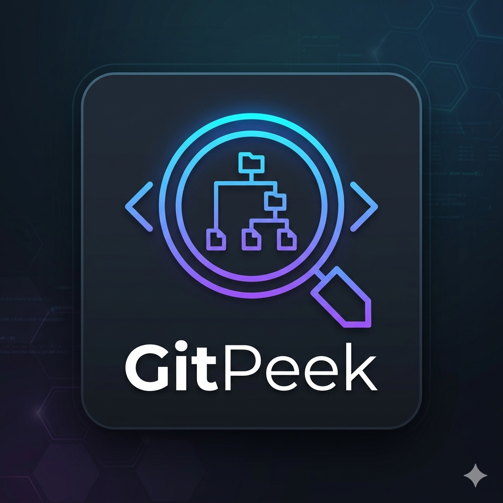

# GitPeek 🔍

> **A beautiful, fast, client-side GitHub repository explorer.**
> Browse files, preview code, search, star favorites — all without cloning anything.

<div align="center">
  

[](https://jhapendra-kandel.github.io/GitPeek/)


</div>

---

## ✨ What is GitPeek?

GitPeek lets you **explore any public GitHub repository** right in your browser — no cloning, no terminal, no accounts required.

Just paste a GitHub URL and instantly get:

- A VS Code–style collapsible file tree
- Syntax-highlighted code preview
- Rendered Markdown with a Table of Contents
- Safe sandboxed HTML preview
- Image, GIF, and video previews
- One-click file downloads
- Full-repo ZIP download

---

## 🚀 Features at a Glance

| Feature                   | Description                                               |
| ------------------------- | --------------------------------------------------------- |
| 📁 **File Explorer**      | Collapsible folder tree, exactly like VS Code             |
| 🔍 **Instant Search**     | Filter all filenames in real-time with match highlighting |
| ⭐ **Favorites**          | Star any file — saved persistently in your browser        |
| 🕓 **Recent Repos**       | Last 10 visited repos auto-saved for quick access         |
| 👁️ **Hover Preview**      | Hover any file for a quick snippet or image thumbnail     |
| ↔️ **Split View**         | Open two files side by side for comparison                |
| 🎨 **3 Themes**           | GitHub Dark · VS Code Dark · Light Minimal                |
| 🔗 **Deep Linking**       | Share a URL with a specific file already open             |
| 📱 **Mobile-Ready**       | Swipe gestures, collapsible drawer, responsive layout     |
| 📝 **Markdown TOC**       | Auto-generated Table of Contents for `.md` files          |
| 🏷️ **File Badges**        | Color-coded badges for JS, TS, HTML, CSS, Py, etc.        |
| 🖱️ **Drag & Drop**        | Drop a GitHub link anywhere on the page to load it        |
| 🔒 **HTML Sandbox**       | Toggle Strict / Relaxed sandbox for HTML previews         |
| ⌨️ **Keyboard Shortcuts** | Full keyboard navigation (see below)                      |
| 📦 **Offline Cache**      | Last-visited files cached for offline viewing             |
| ☑️ **Multi-select**       | Check multiple files and download them all at once        |
| ⬇️ **Download**           | Single file or full ZIP — one click, no login             |

---

## 🖥️ Live Demo

**[https://jhapendra-kandel.github.io/GitPeek/](https://jhapendra-kandel.github.io/GitPeek/)**

---

## 📖 How to Use

### 1. Load a Repository

Paste any of these into the search bar and press **Enter** or click **→**:

```
https://github.com/torvalds/linux
facebook/react
vuejs/vue
```

Or **drag and drop** a GitHub link anywhere on the page.

### 2. Browse Files

- Click **folders** to expand/collapse them
- Click any **file** to preview it in the right pane
- Use **Ctrl+Click** on a file to open it in the **split pane**

### 3. Search Files

- Click the 🔍 **Search tab** in the sidebar (or press `Ctrl+K`)
- Type any filename or extension — results appear instantly
- Click a result to jump to the file in the tree

### 4. Download

- **Single file**: Click the ⬇ button in the pane header, or check files and click "Download Selected"
- **Whole repo**: Click the ZIP icon in the Explorer panel header

### 5. Deep Link — Share a URL

GitPeek automatically updates the browser URL when you open a file:

```
https://jhapendra-kandel.github.io/GitPeek/?repo=owner/repo&file=path/to/file.js
```

Share this link with anyone — they'll land directly on that file!

---

## ⌨️ Keyboard Shortcuts

| Shortcut                | Action                            |
| ----------------------- | --------------------------------- |
| `Ctrl + K` / `Ctrl + P` | Focus file search                 |
| `Ctrl + \`              | Toggle Split View                 |
| `Ctrl + S`              | Star / unstar current file        |
| `← / →`                 | Navigate to previous / next file  |
| `Esc`                   | Close split view / close dropdown |

---

## 🌈 Themes

Switch themes from the ☀️ icon in the top bar:

- **GitHub Dark** — The classic GitHub dark mode palette
- **VS Code Dark** — VS Code's familiar dark editor theme
- **Light Minimal** — Clean, bright, distraction-free

Your choice is saved automatically and persists across visits.

---

## 🏗️ Project Structure

```
GitPeek/
├── index.html        # App shell — all HTML structure
├── style.css         # Complete CSS (themes, layout, components)
├── script.js         # All logic — tree, preview, search, cache, etc.
├── Images/
│   └── Logo.png      # App logo
└── README.md         # This file
```

---

## 🛠️ Technical Details

- **100% static** — no server, no backend, no build step
- **GitHub Public API** only — no authentication required
- **Libraries used (CDN only)**:
  - jQuery 3.7 — DOM & AJAX
  - Prism.js — syntax highlighting
  - marked.js — Markdown rendering
  - DOMPurify — XSS-safe HTML sanitization
- **Storage**: LocalStorage (favorites, recent, theme) + Cache API (offline files)
- **Security**: All HTML previews run inside `<iframe sandbox>`, all rendered Markdown is sanitized with DOMPurify

### GitHub API Rate Limiting

GitPeek uses the **unauthenticated** GitHub API, which allows **60 requests per hour** per IP address.
The rate-limit badge in the top bar shows how many requests remain.

---

## 🚢 Deploy to GitHub Pages

1. Fork or clone this repository
2. Go to your repo → **Settings** → **Pages**
3. Source: **Deploy from a branch** → Branch: `main` → Folder: `/ (root)`
4. Click **Save** — GitHub will give you a URL in ~30 seconds
5. Your app is live! ✅

That's it — no `npm install`, no build commands, nothing.

---

## 🤝 Contributing

Pull requests welcome! Areas for improvement:

- Support for authenticated API calls (higher rate limits)
- More language icons
- Better mobile layout
- Accessibility improvements

---

## 📜 License

MIT © GitPeek contributors

---

<div align="center">
  Made with ❤️ — 100% static, zero servers, all vibes.
</div>
